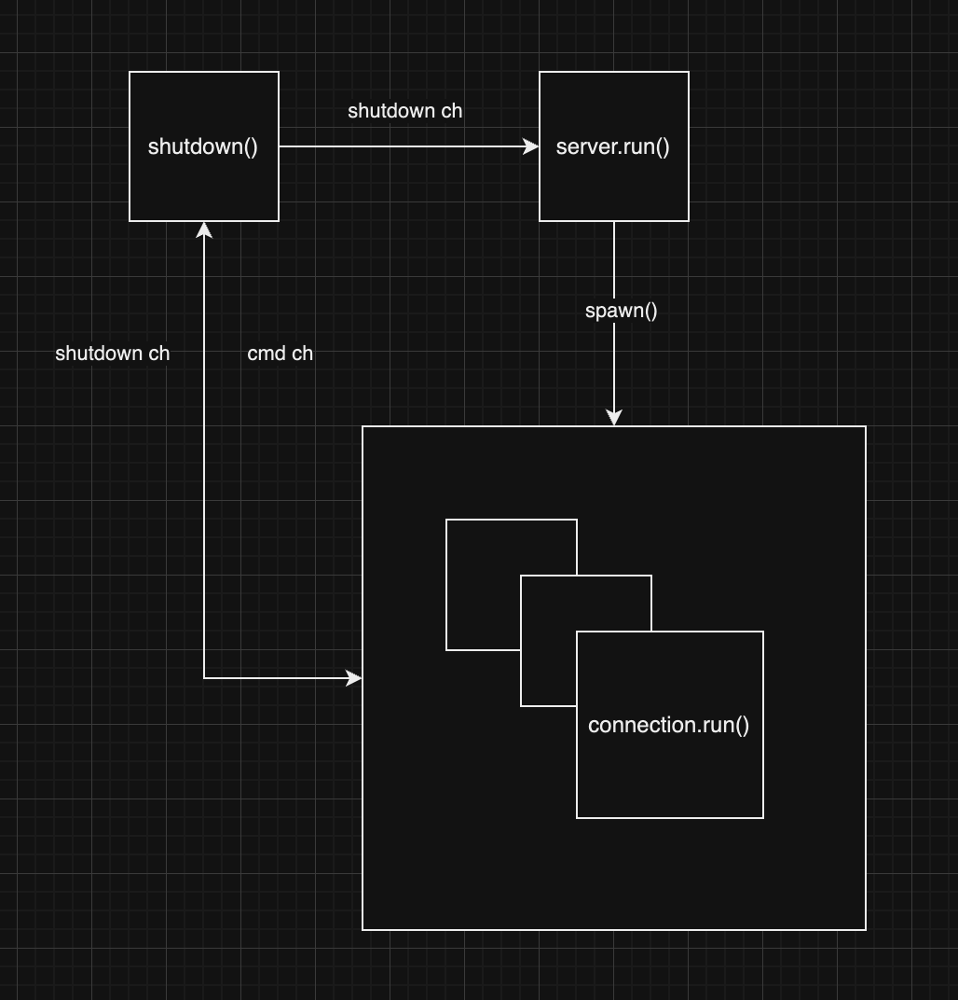

# Line Server - Alex Kennedy

## How Does the System Work?

The server runs itself in a thread.  It listens for TCP connections and then spawns a new Tokio task for each connection.  Each connection listens for commands and then acts according to the command that it received.

The server also runs a shutdown thread.  When a connection sends a SHUTDOWN command, the shutdown task listens on the CMD channel and then sends a message through the SHUTDOWN channel to each other connection as well as the main server process.

When the main server loop receives a SHUTDOWN command it waits for each of its connections to gracefully exit before shutting down itself gracefully.

### Frame Specification

Each frame has a 7 byte specification:

[COMMAND, line number parameter (32-bit unsigned int), checksum, termination]

The command is Ascii:

0 - GET

1 - QUIT

2 - SHUTDOWN

The line number parameter is a 32-bit Little Endian unsigned integer.

Checksum is the SUM of the command byte (ascii encoded) and the line number MOD 256 and is a single byte.

The termination character is a newline (0x0A).

## How does the system perform as the number of requests per second increases?

I benchmarked this server with a Python application.  I was able to achieve 120,000 req/s with 30 Python threads.  I'm satisfied with this throughput. **When logging was added however, the performance of the server dropped DRASTICALLY.**

With the index system for the file, the lookup for a line is O(1) which is how I was able to achieve this throughput.

## How will the system perform with a 1GB, 100GB, 1000GB file?

A 1 and 100 GB file shouldn't be an issue, as long as you have enough memory to store the index.  My index file is around 20% of the size of the text file that I used to test but this ratio depends on the size of the contents of each line in the DB file.

The index process is also fairly quick.  A 1GB file took around 8s to index on my M3 Mac Pro.  I am satisfied with this performance.

In order to improve the size of the file that the system can handle, I would reduce the size of the index by implementing a sparse index using any number of algorithms.  This would decrease the throughput but not by much.  There are trade-offs to be made here where you can either slow down the index process or the throughput and for this database driver I chose throughput and did not implement a sparse index.

The index file could also be further compressed to improve this.

## What docs, sites, papers etc. did you use to implement?

The only sources that I used were ChatGPT and my Kleppman Data Intensive Applications book.

I used ChatGPT as a search engine to ask various questions about TCP streams and Tokio performance.

Then, for the database indexing and storage retrival I referred to the retrieval chapter of the Data Intensive Applications textbook that I have at home.

Other than that, I used stack overflow for a few questions, but nothing significant.  I also referred to Rust docs for the std TCP library.

## What 3rd party libraries do we use?

I used:

Tokio - async driver

fern - logger

chrono - time library

serde - database index serialization

rmp-serde - msgpack compression for the index

anyhow - error handling

uuid - connection ID generation

## How long did you spend on this exercise?

For the actual implementation, I spent around 12 hours.  2 hours for manual test cases and testing.  For the documentation I spent around 1 hour.  This makes 15 hours total.

